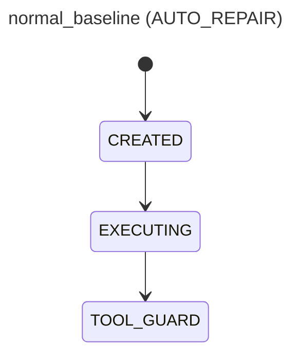
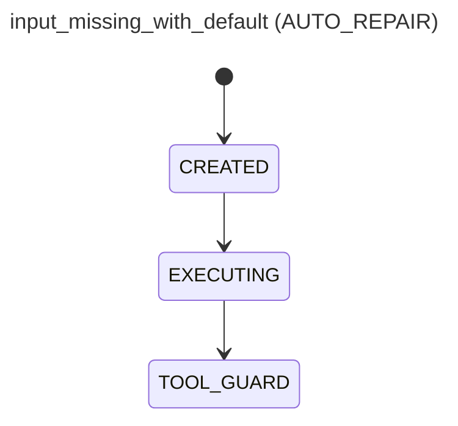
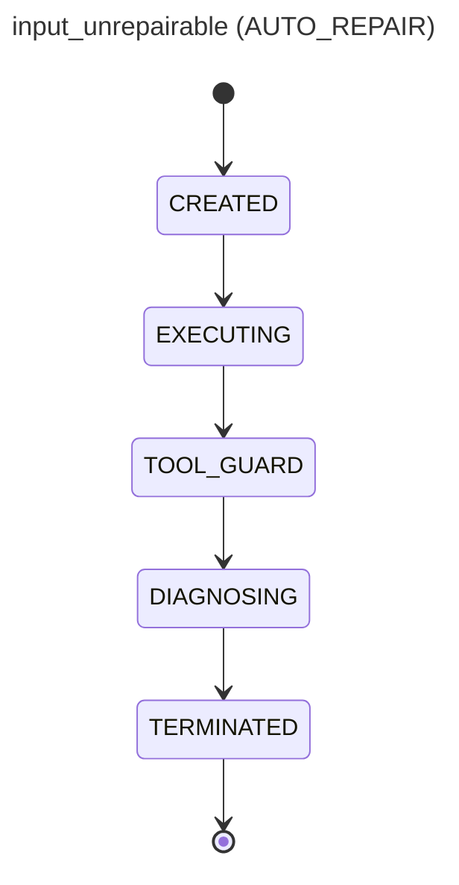
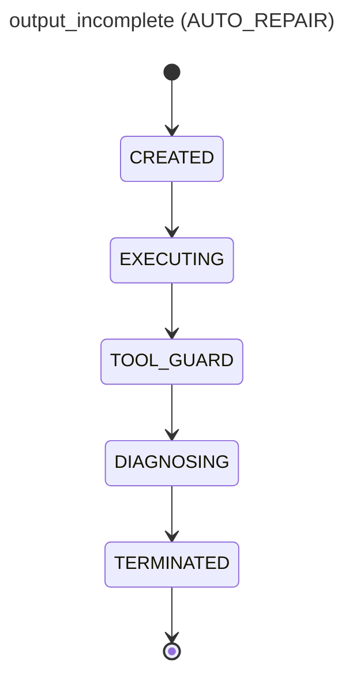
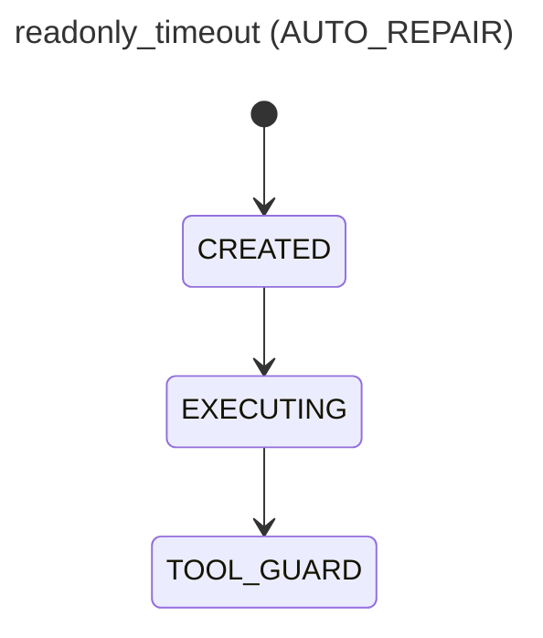
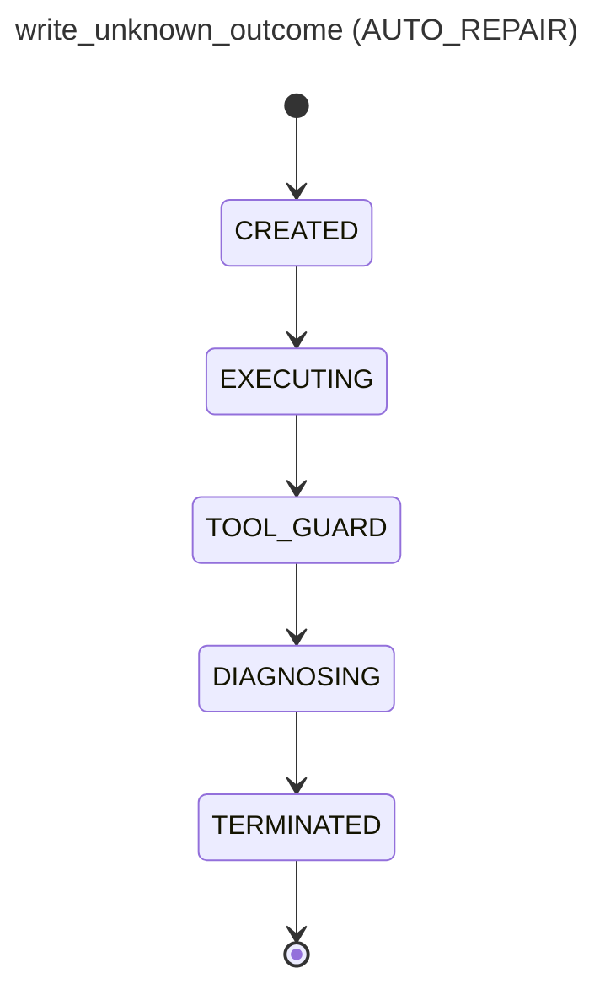
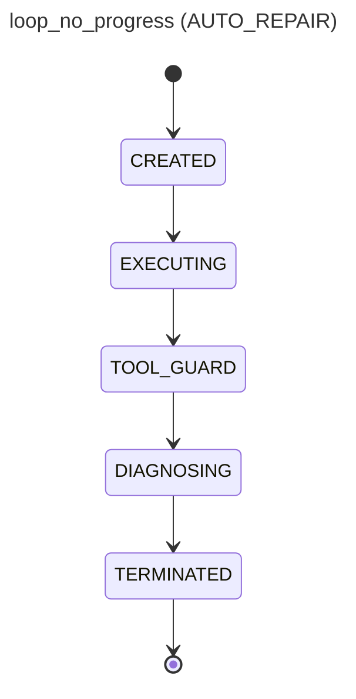
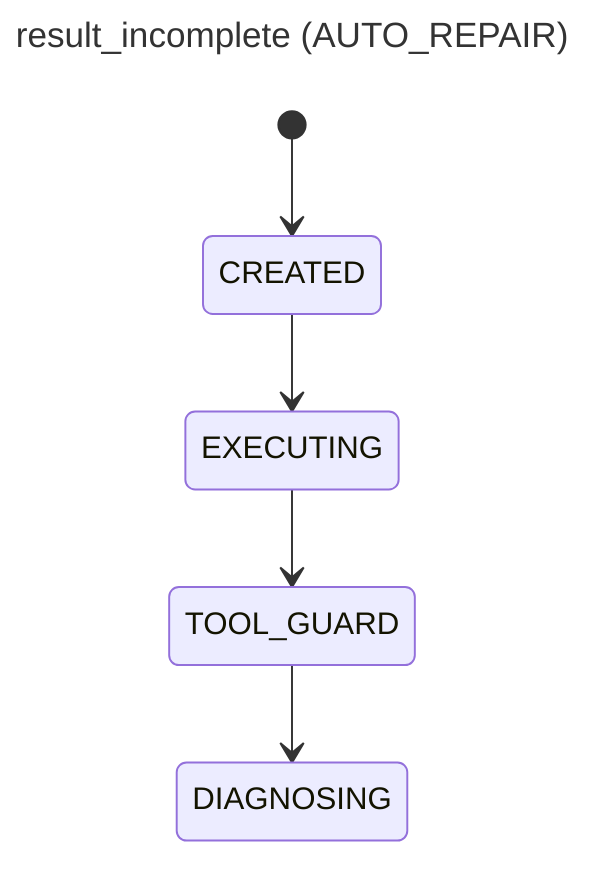

# AgentMesh P37 Agent Harness 离线评测报告

对照口径：每个固定样例分别以 `OFF`（普通 Agent，无监督）与 `AUTO_REPAIR`（Harness Agent）运行。全部样例确定性注入故障，可重复执行。

## 一、普通 Agent vs Harness Agent 成功率

- 普通 Agent（OFF）业务成功率：**37.5%**
- Harness Agent（AUTO_REPAIR）业务成功率：**50.0%**（恢复成功计入成功；不可恢复故障按白名单安全终止）

## 二、验收指标

| 指标 | 数值 |
| --- | --- |
| 故障检测率（预置故障全部检出） | 100.0 |
| 支持场景恢复率（白名单恢复案例全部成功） | 100.0 |
| 故障逃逸率（AUTO_REPAIR，要求为 0） | 0.0 |
| 故障逃逸率（OFF 基线，用于对照） | 28.6 |
| 正常误拦截率（要求为 0） | 0.0 |
| 循环终止率 | 100.0 |
| 执行开销 P50（相对 OFF，ms） | 0.0 |
| 执行开销 P95（相对 OFF，ms） | 342 |
| Harness 事件总量 | 50 |

## 三、逐样例对照

### 正常基线（normal_baseline · 工具类型 internal）

- 期望：OFF 与 AUTO_REPAIR 业务结果一致，不发生修复
- OFF：成功=True 逃逸=False 执行动作=1 耗时=0ms
- AUTO_REPAIR：成功=True 检出=False 恢复=False 终止=False，恢复动作=[] 耗时=0ms

**执行日志（AUTO_REPAIR）**

```text
[   0ms] tool call query_order completed
```

**状态转移图**



### 输入缺字段（input_missing_with_default · 工具类型 internal）

- 期望：检测并只补 schema default
- OFF：成功=False 逃逸=False 执行动作=0 耗时=0ms
- AUTO_REPAIR：成功=True 检出=True 恢复=True 终止=False，恢复动作=['REPAIR_ARGS'] 耗时=0ms

**执行日志（AUTO_REPAIR）**

```text
[   0ms] tool call query_order completed
```

**状态转移图**



### 输入不可修复（input_unrepairable · 工具类型 internal）

- 期望：不调用工具，明确终止
- OFF：成功=False 逃逸=False 执行动作=0 耗时=0ms
- AUTO_REPAIR：成功=False 检出=True 恢复=False 终止=True，原因=INPUT_VALIDATION_INPUT_REQUIRED_MISSING，恢复动作=[] 耗时=0ms

**执行日志（AUTO_REPAIR）**

```text
[   0ms] harness terminated before action: INPUT_VALIDATION_INPUT_REQUIRED_MISSING
```

**状态转移图**



### 输出不完整（output_incomplete · 工具类型 mcp）

- 期望：检测失败，不把结果作为成功返回
- OFF：成功=True 逃逸=True 执行动作=1 耗时=0ms
- AUTO_REPAIR：成功=False 检出=True 恢复=False 终止=True，原因=OUTPUT_SCHEMA_INVALID，恢复动作=['RETRY'] 耗时=0ms

**执行日志（AUTO_REPAIR）**

```text
[   0ms] harness terminated before action: OUTPUT_SCHEMA_INVALID
```

**状态转移图**



### 只读超时（readonly_timeout · 工具类型 http）

- 期望：预算内重试一次并记录恢复
- OFF：成功=False 逃逸=False 执行动作=0 耗时=607ms
- AUTO_REPAIR：成功=True 检出=True 恢复=True 终止=False，恢复动作=['RETRY'] 耗时=949ms

**执行日志（AUTO_REPAIR）**

```text
[ 949ms] tool call query_order completed
```

**状态转移图**



### 写操作状态未知（write_unknown_outcome · 工具类型 http）

- 期望：不自动重试，终止并提示人工确认
- OFF：成功=False 逃逸=False 执行动作=0 耗时=602ms
- AUTO_REPAIR：成功=False 检出=True 恢复=False 终止=True，原因=TOOL_OUTCOME_UNKNOWN，恢复动作=[] 耗时=619ms

**执行日志（AUTO_REPAIR）**

```text
[ 618ms] harness terminated before action: TOOL_OUTCOME_UNKNOWN
```

**状态转移图**



### 循环（loop_no_progress · 工具类型 internal）

- 期望：第三次执行前终止
- OFF：成功=False 逃逸=False 执行动作=4 耗时=0ms
- AUTO_REPAIR：成功=False 检出=True 恢复=False 终止=True，原因=LOOP_DETECTED，恢复动作=[] 耗时=0ms

**执行日志（AUTO_REPAIR）**

```text
[   0ms] tool call query_order completed
[   0ms] tool call query_order completed
[   0ms] harness terminated before action: LOOP_DETECTED
```

**状态转移图**



### 结果不完整（result_incomplete · 工具类型 internal）

- 期望：一次重规划，仍失败则终止
- OFF：成功=True 逃逸=True 执行动作=1 耗时=0ms
- AUTO_REPAIR：成功=True 检出=True 恢复=True 终止=False，恢复动作=['REPLAN'] 耗时=0ms

**执行日志（AUTO_REPAIR）**

```text
[   0ms] tool call query_order completed
[   0ms] harness issued one bounded replan
[   0ms] replan produced a complete result
```

**状态转移图**


